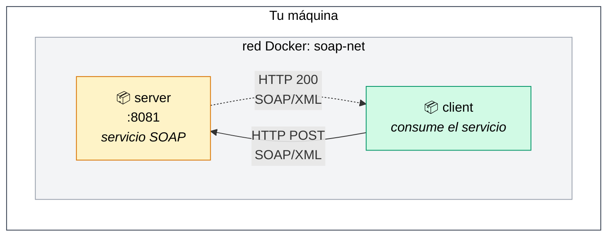
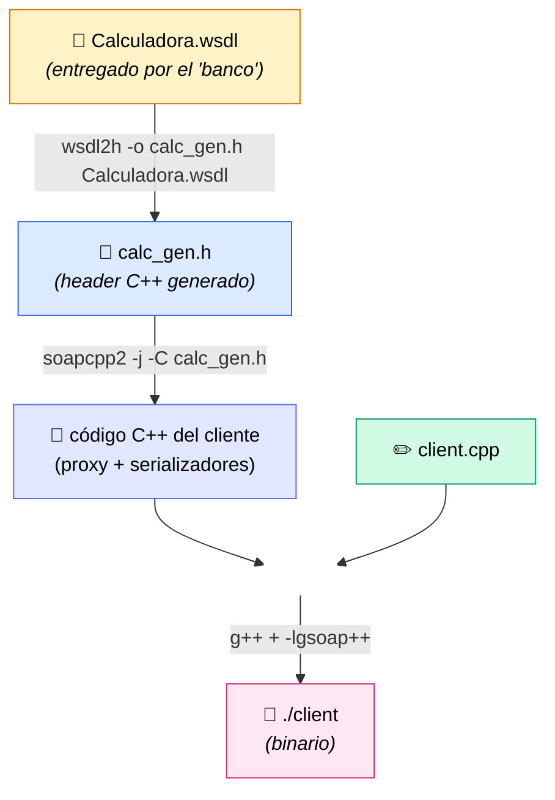

# Lab gSOAP — Caso 3: Consumir un servicio SOAP externo en C++

Laboratorio dockerizado que demuestra cómo consumir un servicio web SOAP cuyo contrato (WSDL) viene de un sistema externo. Escenario típico al integrar con bancos, pasarelas de pago o cualquier sistema legacy que exponga SOAP/XML.

> **Caso 3** en la documentación de gSOAP: el contrato no lo escribes tú, te lo dan en formato WSDL. Tu trabajo es convertirlo a código C++ con `wsdl2h`, generar el cliente con `soapcpp2`, compilarlo y consumir el servicio.

---

## Requisitos

- Docker 20.10+
- Docker Compose v2 (`docker compose` con espacio, no `docker-compose`)

Nada más. No necesitas instalar gSOAP, C++ ni nada en tu máquina: todo corre dentro de contenedores.

---

## Estructura del proyecto

```
gsoap-lab-caso3/
├── docker-compose.yml          ← orquesta server + client
├── server/
│   ├── Dockerfile              ← imagen del servicio simulado
│   ├── calc.h                  ← contrato C++ (con //gsoap directivas)
│   └── server.cpp              ← lógica del servicio
└── client/
    ├── Dockerfile              ← imagen del cliente (flujo CASO 3)
    ├── Calculadora.wsdl        ← contrato "externo" entregado por el servicio
    └── client.cpp              ← código que consume el servicio
```

---

## Arquitectura del lab



Los dos contenedores corren en una red Docker interna llamada `soap-net`. El cliente resuelve `http://server:8081` por nombre, gracias al DNS interno de Docker.

---

## Inicio rápido

### 1. Clonar y entrar al proyecto

```bash
git clone <URL-DE-ESTE-REPO> gsoap-lab-caso3
cd gsoap-lab-caso3
```

### 2. Construir y levantar

```bash
docker compose up --build -d
```

La primera vez tarda 2-3 minutos (descarga la imagen base + instala gSOAP + compila todo). Las siguientes son segundos.

### 3. Verificar que ambos contenedores están arriba

```bash
docker compose ps
```

Esperado:
```
NAME           STATUS              PORTS
gsoap-server   Up X seconds        0.0.0.0:8081->8081/tcp
gsoap-client   Up X seconds
```

### 4. Ejecutar el cliente

```bash
docker compose exec client ./client
```

Esperado:
```
[CLIENT] Conectando a http://server:8081
[CLIENT] Llamando convertir(100, 3.85)...
[CLIENT] ✓ Resultado: 100 x 3.85 = 385
```

Y en los logs del servidor:
```bash
docker compose logs server
```
```
[SERVER] Servicio SOAP escuchando en puerto 8081...
[SERVER] convertir(100, 3.85) = 385
```

---

## Probar con valores distintos

El cliente acepta argumentos para cambiar el monto y la tasa:

```bash
docker compose exec client ./client 2500 0.92
docker compose exec client ./client 1 1
docker compose exec client ./client 999999 0.001
```

---

## Probar el servidor desde fuera de Docker (opcional)

El puerto 8081 está mapeado al host. Puedes mandar XML directo con `curl`:

```bash
curl -X POST http://localhost:8081 \
  -H "Content-Type: text/xml" \
  -d '<?xml version="1.0"?>
<SOAP-ENV:Envelope xmlns:SOAP-ENV="http://schemas.xmlsoap.org/soap/envelope/"
                   xmlns:ns="urn:calculadora">
  <SOAP-ENV:Body>
    <ns:convertir>
      <monto>500</monto>
      <tasa>4.20</tasa>
    </ns:convertir>
  </SOAP-ENV:Body>
</SOAP-ENV:Envelope>'
```

Esto demuestra que el servidor responde XML estándar, no algo propietario.

---

## Lo que demuestra este lab

### Caso 3 — flujo del cliente

Cuando construyes la imagen del cliente, esto es lo que ocurre dentro del `Dockerfile`:



Los tres comandos clave (ver `client/Dockerfile`):

| Paso | Comando | Qué hace |
|---|---|---|
| 1 | `wsdl2h -o calc_gen.h Calculadora.wsdl` | Convierte el WSDL XML en un header C++ |
| 2 | `soapcpp2 -j -C calc_gen.h` | Genera el proxy del cliente y los serializadores |
| 3 | `g++ ... -lgsoap++` | Compila el binario final |

### División de trabajo

| Lo que TÚ escribes | Lo que gSOAP genera |
|---|---|
| `client.cpp` (40 líneas) | `calc_gen.h` (300+ líneas, de wsdl2h) |
| | `soapCalculadoraProxy.h/.cpp` |
| | `soapC.cpp` (~63 KB de serializadores) |
| | `soapH.h`, `soapStub.h`, `Calculadora.nsmap` |

Tú vives en **un solo archivo**. Todo lo demás es ruido autogenerado que solo compilas.

---

## Modificar el lab

### Modo desarrollo (editar y rebuild)

Edita `client/client.cpp` (o `server/server.cpp`) y reconstruye solo ese servicio:

```bash
# tras editar el cliente:
docker compose up -d --build client

# tras editar el servidor:
docker compose up -d --build server
```

### Entrar a un contenedor para inspeccionar

```bash
# ver los archivos generados por gSOAP dentro del cliente:
docker compose exec client bash
# dentro:
#   ls /app
#   ./client 50 2
#   exit
```

> Nota: la imagen final es slim y no trae bash. Si quieres inspeccionar archivos generados (`calc_gen.h`, `soapCalculadoraProxy.cpp`, etc.) edita el Dockerfile para no usar multi-stage temporalmente.

---

## Detener y limpiar

```bash
# detener los contenedores
docker compose down

# detener + borrar imágenes (para empezar de cero)
docker compose down --rmi all
```

---

## Errores comunes

| Error | Causa | Solución |
|---|---|---|
| `Could not connect (SP_error -2)` | El servidor no está corriendo o el cliente apunta mal | `docker compose ps` y verificar que `gsoap-server` esté `Up` |
| `wsdl2h: command not found` durante build | Falló la instalación de `gsoap` en el Dockerfile | Reconstruir: `docker compose build --no-cache` |
| `port is already allocated` al levantar | El puerto 8081 ya está usado por otro proceso | Cambiar el mapping en `docker-compose.yml`: `"9000:8081"` |
| El cliente conecta pero `response.resultado` es null | Problema con el namespace `ns1` vs `ns` | Verificar que el `client.cpp` use `_ns1__convertir` (con `ns1`) |

---

## Cómo se relaciona esto con la realidad

En un proyecto real, este lab corresponde al siguiente escenario:

1. **El banco te entrega su `Calculadora.wsdl`** (en este lab es el archivo en `client/Calculadora.wsdl`).
2. **Tú construyes solo el cliente** (todo el directorio `client/`).
3. **El servidor lo opera el banco** (en este lab lo simulamos con `server/` para que puedas probar local).

El flujo de comandos que ejecutaste (`wsdl2h` → `soapcpp2 -C` → `g++`) es exactamente lo que harías en producción para integrarte con un servicio SOAP externo.

---

## Recursos

- [Documentación oficial de gSOAP](https://www.genivia.com/dev.html)
- [Especificación SOAP 1.1](https://www.w3.org/TR/2000/NOTE-SOAP-20000508/)
- [Especificación WSDL 1.1](https://www.w3.org/TR/wsdl/)

---

## Licencia

MIT. Úsalo, modifícalo, compártelo.
