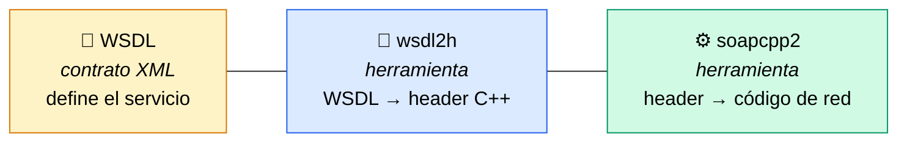
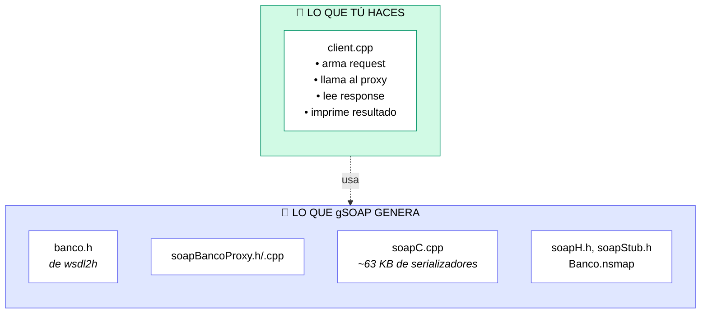
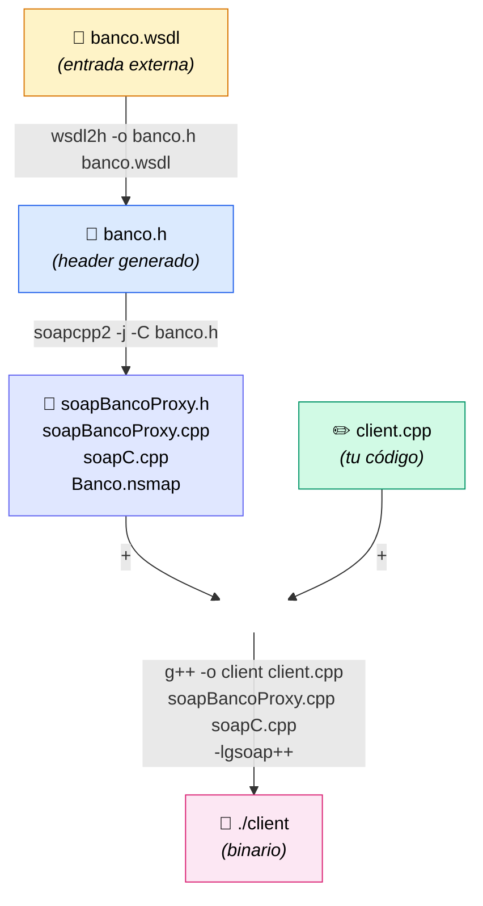
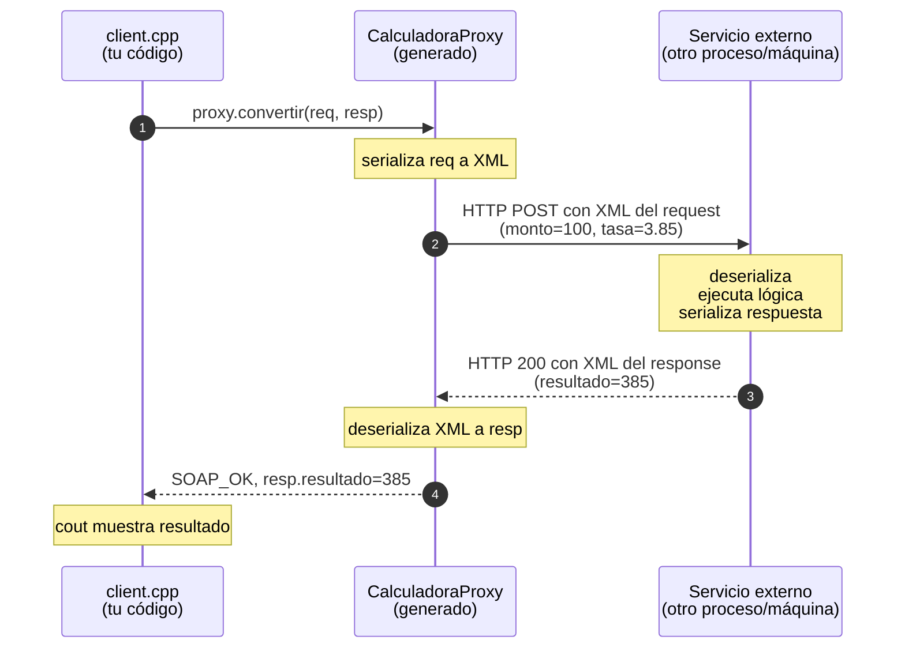

# gSOAP — Caso 3: Diagramas

Cuatro vistas distintas del mismo proceso, de lo más general a lo más operativo. Cada diagrama responde a una pregunta específica que típicamente surge al aprender gSOAP.

---

## 1. ¿Qué es cada cosa? — Mapa mental

Antes de tocar comandos, hay que saber qué papel cumple cada pieza. Estas son las 3 que más se confunden:

**Idea clave:** WSDL es un **archivo** (el contrato). `wsdl2h` y `soapcpp2` son **herramientas** distintas con propósitos distintos. Confundirlas es el error más común.

---

## 2. ¿Qué escribo yo y qué genera gSOAP? — División de trabajo

Lo que más frena al principio es la cantidad de archivos. Este diagrama deja claro que tú solo escribes **uno**:

**Idea clave:** todo lo del bloque morado es ruido autogenerado. No lo lees, no lo editas. Solo compilas y olvidas. Tú vives en `client.cpp`.

---

## 3. Pipeline operativo — Qué genera cada paso

La guía paso a paso para ir del WSDL al binario. Cada flecha es un comando:

**Idea clave:** son **3 comandos en total**: `wsdl2h`, `soapcpp2`, `g++`. Nada más. Lo demás es código y archivos que pasan entre ellos.

---

## 4. Anatomía de una llamada en runtime — Qué viaja por la red

Después de compilar, ¿qué pasa cuando ejecutas `./client`? Esta es la vista dinámica:

**Idea clave:** lo que **parece** una llamada local (`proxy.convertir(...)`) es en realidad un viaje completo de XML por HTTP. El proxy es quien hace toda esa magia sin que tú escribas una línea de red.

---

## Cómo usar este documento

Recomendación para tus alumnos:

1. Lee los **diagramas 1 y 2 primero** (5 min). Te sitúa antes de tocar comandos.
2. Sigue el **diagrama 3** como guía para hacer el lab paso a paso.
3. Una vez compilado, mira el **diagrama 4** para entender qué pasa en runtime.
